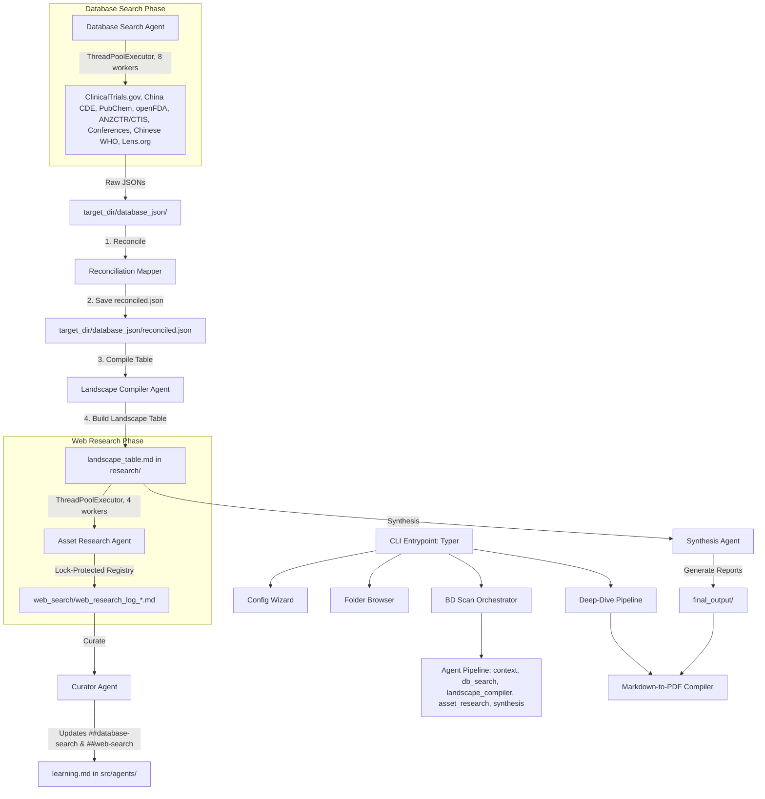

# System Architecture (`docs/architecture.md`)

This document outlines the high-level architecture, directory layouts, and data flow pipelines of the Biotech Analyst CLI (`ba`).

---

## 1. High-Level Architecture

The Biotech Analyst CLI combines deterministic, zero-hallucination data compilation scripts with an LLM-powered multi-agent pipeline for due diligence context mapping and report synthesis.

The broad scan pipeline (`bdscan`) uses a concurrent, reconciled agent architecture to fetch and process registry databases in parallel, map synonyms using a dedicated reconciliation layer, compile tables via direct Python imports, and execute concurrent web research.



---

## 2. Directory Structure

```
biotech-analyst-cli/
├── docs/                           # Project documentation and specifications
│   ├── architecture.md             # System design and directory layout (this file)
│   ├── cli_spec.md                 # CLI parameters and option behaviors
│   ├── bdscan_spec.md              # Multi-agent broad scan design specification
│   └── roadmap.md                  # Implementation roadmap and status milestones
├── src/                            # Core application package
│   ├── cli/                        # CLI Commands definition
│   │   └── main.py                 # Command router and main execution loop
│   ├── core/                       # Shared configurations and orchestrators
│   │   ├── config.py               # Pydantic configuration loaded from .env
│   │   ├── exceptions.py           # Custom exception definitions
│   │   ├── bdscan_orchestrator.py  # Orchestrator for the BD Scan agents
│   │   └── deepdive_orchestrator.py # Orchestrator for the Deep Dive agents
│   ├── services/                   # Unified API services
│   │   └── llm_client.py           # Gemini, OpenRouter, and DeepSeek client (thread-safe FIFO queue)
│   ├── agents/                     # Multi-Agent workflows
│   │   ├── learning.md             # Global pipeline learnings and lessons (max 20 lines/section)
│   │   ├── bdscan_agents/          # Pathway Broad Scan agents
│   │   │   ├── context_agent.py    # 1-turn scientific context compiler
│   │   │   ├── db_search_agent.py  # 4-turn concurrent database search coordinator
│   │   │   ├── curator_agent.py    # Stage-end compiler of global learnings
│   │   │   ├── landscape_compiler_agent.py # Consolidator orchestrating table building
│   │   │   ├── asset_research_agent.py # 4-turn concurrent row-specific web researcher
│   │   │   └── synthesis_agent.py  # 10-turn executive report synthesizer
│   │   └── deepdive_agents/        # Deep-dive agent directory
│   ├── tools/                      # Programmatic fetchers, summarizers, and classifiers
│   │   ├── classify_interventions.py # LLM-based asset/modality classifier and synonym resolution
│   │   ├── fetch_clinicaltrials.py # ClinicalTrials.gov query API
│   │   ├── fetch_anzctr_ctis.py    # ANZCTR & EU CTIS search API
│   │   ├── fetch_conferences.py    # ASCO/AACR abstract scraper
│   │   ├── fetch_chinese_registries.py # WHO ICTRP & ChiCTR search client
│   │   ├── fetch_china_direct.py   # Playwright scraper for NMPA CDE
│   │   ├── fetch_ip_lens.py        # Patent search API client
│   │   ├── fetch_pubchem.py        # PubChem Compound search client
│   │   └── fetch_openfda.py        # FDA safety labeling API client
│   └── utils/                      # Programmatic parsers and report utilities
│       ├── formatting.py           # Dr. Hops speech bubbles and Rich console
│       ├── parse_pdf.py            # PDF text and table extractor
│       ├── validate_report.py      # Validator checking IDs against raw logs
│       ├── convert_md_to_pdf.py    # Paginated PDF compiler
│       ├── query_parser.py         # Search query translation and parsing helper
│       ├── generate_landscape_table.py # Re-export shim for landscape table compilation
│       └── landscape/              # Modular competitive landscape compilation package
│           ├── __init__.py
│           ├── table_formatters.py # Constants and parsing utilities
│           ├── config_builder.py   # Synonym grouping and configuration discovery
│           ├── table_builder.py    # Table construction loop
│           ├── exporters.py        # CSV and text formatters
│           └── reconciliation.py   # Multi-source database reconciliation mapper
├── tests/                          # Project unit, integration, and command-line test suite
│   ├── test_agents.py              # Multi-agent workflows integration tests
│   ├── test_config.py              # Configuration and LLM queue manager tests
│   ├── test_query_parser.py        # Scientific query regex/LLM parser tests
│   ├── run_tests.py                # Command-line subprocess tests for fetchers
│   ├── test_landscape_modules.py  # Tests for modularized landscape table generation
│   ├── test_classify_interventions.py # Tests for LLM intervention classification and validation
│   ├── test_reconciliation.py      # Tests for broad scan data reconciliation and mapper logic
│   └── test_concurrency.py         # Tests for thread pool and lock-protected registry concurrency
├── pyproject.toml                  # Python package configuration (uv managed)
├── uv.lock                         # Lockfile for python packages
└── AGENTS.md                       # Project index and architectural constraints
```

---

## 3. Data Pipelines Flow

1. **Configuration (`ba config`):** Wizard that creates/saves name, email, research folder target, and LLM API keys directly to `.env` in the current folder.
2. **Interactive Folder Navigator (`ba folder`):** Interactive listing of research folders enabling users to browse and open directories in Windows Explorer.
3. **Pathway Scan (`ba bdscan`):** Runs the agent-based scanner:
   - **Context Stage:** Context Agent writes a short, scientific `context.md`.
   - **Database Search Stage:** Database Search Agent queries 8 databases concurrently, saving raw files in `{target_dir}/database_json/`.
   - **Reconciliation Stage:** Reconciliation Mapper extracts registry results, runs them through the LLM synonym classifier to group variants into canonical clusters, and writes `{target_dir}/database_json/reconciled.json`.
   - **Landscape Table Compilation:** Landscape Compiler Agent calls the modular `landscape` table builders to compile the master `landscape_table.md` in `research/`.
   - **Web Research Stage:** Asset Research Agent conducts concurrent, lock-protected web searches on assets to fill qualitative columns.
   - **Synthesis Stage:** Synthesis Agent drafts strategic reports and compiles them to PDF.
4. **Diligence Deep-dive (`ba deepdive`):** Queries registries, openFDA, and PubChem for a single asset, logs results to markdown files, and compiles a comprehensive due diligence memo.

---

## 4. Concurrency and Reliability

To guarantee robust operations during high-frequency agent execution, the system incorporates the following concurrency and reliability features:
1. **Thread-Safe LLM Client Queue:** Every LLM call is routed through a global module-level FIFO queue processed sequentially by a daemon worker thread. Under Pytest execution, a synchronous lock-based mechanism is used to ensure compatibility with unit test mocks.
2. **Registry Concurrency (`ThreadPoolExecutor`):** The Database Search phase executes queries concurrently across all 8 supported registries using up to 8 workers, dramatically reducing search execution times.
3. **Web Research Concurrency (`ThreadPoolExecutor`):** Executes qualitative asset web searches in parallel with up to 4 concurrent workers (capped to prevent rate limits).
4. **Lock-Protected Registry:** A `threading.Lock` protects the active asset claim registry. Before researching an asset, workers check if the asset or any of its aliases are already being researched. This eliminates duplicate research efforts.
5. **Dual-Level Retry & Backoff:**
   - **Connection Level:** Retries on connection timeouts or network drops (`httpx.RequestError`) up to 3 times, using exponential backoff (1.0s base, 2.0x multiplier).
   - **LLM Level:** Retries on transient API/server errors (`httpx.HTTPStatusError` with codes 429, 500, 502, 503, 504) up to 5 times, using exponential backoff (2.0s base, 2.0x multiplier). Fatal client errors (e.g. 400, 401, 403, 404) fail immediately.
