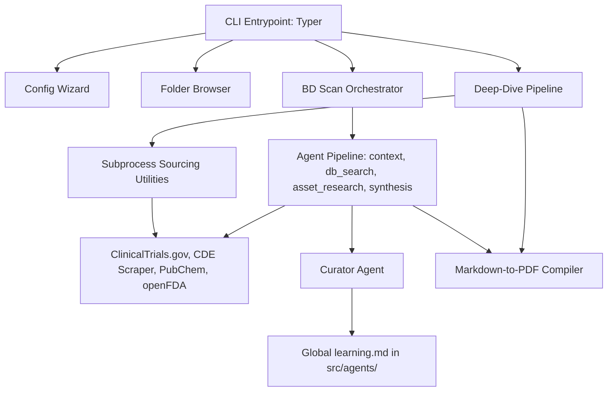

# System Architecture (`docs/architecture.md`)

This document outlines the high-level architecture, directory layouts, and data flow pipelines of the Biotech Analyst CLI (`ba`).

---

## 1. High-Level Architecture

The Biotech Analyst CLI is structured to combine deterministic, zero-hallucination data compilation scripts with an LLM-powered multi-agent pipeline for due diligence context mapping and report synthesis.



---

## 2. Directory Structure

```
biotech-analyst-cli/
├── docs/                           # Project documentation and specifications
│   ├── architecture.md
│   ├── cli_spec.md
│   ├── bdscan_spec.md
│   └── roadmap.md
├── tmp/                            # Temporary raw records, databases, and tables
├── src/                            # Core application package
│   ├── cli/                        # CLI Commands definition
│   │   └── main.py                 # Command router and main execution loop
│   ├── core/                       # Shared configurations and exceptions
│   │   ├── config.py               # Pydantic configuration loaded from .env
│   │   ├── exceptions.py           # Custom exception definitions
│   │   ├── bdscan_orchestrator.py  # Orchestrator for the BD Scan agents
│   │   └── deepdive_orchestrator.py # Orchestrator for the Deep Dive agents
│   ├── services/                   # Unified API services
│   │   └── llm_client.py           # Gemini, OpenRouter, and DeepSeek client (with thread-safe sequential queue and dual-level retry/backoff)
│   ├── agents/                     # Multi-Agent workflows
│   │   ├── learning.md             # Global pipeline learnings and lessons
│   │   ├── bdscan_agents/          # Pathway Broad Scan agent directory
│   │   │   ├── context_agent.py    # 1-turn scientific context compiler
│   │   │   ├── db_search_agent.py  # 4-turn database search coordinator
│   │   │   ├── compile_landscape.py # Script consolidating database outputs
│   │   │   ├── asset_research_agent.py # 4-turn row-specific web researcher
│   │   │   ├── synthesis_agent.py  # 10-turn executive report synthesizer
│   │   │   └── curator_agent.py    # Stage-end compiler of global learnings
│   │   └── deepdive_agents/        # Deep-dive agent directory
│   ├── tools/                      # Programmatic fetchers and summarizers (agent tools registry)
│   │   ├── fetch_clinicaltrials.py # ClinicalTrials.gov query API
│   │   ├── fetch_anzctr_ctis.py    # ANZCTR & EU CTIS search API
│   │   ├── fetch_conferences.py    # ASCO/AACR abstract scraper
│   │   ├── fetch_chinese_registries.py # WHO ICTRP & ChiCTR search client
│   │   ├── fetch_china_direct.py   # Playwright scraper for NMPA CDE
│   │   ├── fetch_ip_lens.py        # Patent search API client
│   │   ├── fetch_pubchem.py        # PubChem Compound search client
│   │   └── fetch_openfda.py        # FDA safety labeling API client
│   └── utils/                      # Programmatic parsers and report utilities
│   │   ├── formatting.py           # Dr. Hops speech bubbles and Rich console
│   │   ├── parse_pdf.py            # PDF text and table extractor
│   │   ├── generate_landscape_table.py # Script building competitive matrix
│   │   ├── validate_report.py      # Validator checking IDs against raw logs
│   │   └── convert_md_to_pdf.py    # Paginated PDF compiler
├── tests/                          # Project unit, integration, and command-line test suite
│   ├── test_agents.py              # Multi-agent workflows integration tests
│   ├── test_config.py              # Configuration and LLM queue manager tests
│   ├── test_query_parser.py        # Scientific query regex/LLM parser tests
│   └── run_tests.py                # Command-line subprocess tests for fetchers
├── pyproject.toml                  # Python package configuration (uv managed)
├── uv.lock                         # Lockfile for python packages
└── AGENTS.md                       # Project index and architectural constraints
```

---

## 3. Data Pipelines Flow

1. **Configuration (`ba config`):** Wizard that creates/saves name, email, research folder target, and LLM API keys directly to `.env` in the current folder.
2. **Interactive Folder Navigator (`ba folder`):** Interactive listing of research folders enabling users to browse and open directories in Windows Explorer.
3. **Pathway Scan (`ba bdscan`):** Runs the agent-based scanner to construct context files, query databases in multiple languages, compile competitive matrices, conduct web searches, validate results, and generate paginated PDFs.
4. **Diligence Deep-dive (`ba deepdive`):** Queries registries, openFDA, and PubChem for a single asset, logs results to markdown files, and compiles a comprehensive due diligence memo.

---

## 4. LLM Client Reliability and Race Condition Prevention

To guarantee robust operations during high-frequency agent execution, the `LLMClient` incorporates the following features:
1. **Thread-Safe Sequential Queue:** Every LLM call is routed through a global module-level FIFO queue processed sequentially by a daemon worker thread. This prevents race conditions and LLM service overloading. Under Pytest execution, a synchronous lock-based mechanism is used to ensure compatibility with unit test mocks.
2. **Dual-Level Retry & Backoff:** 
   - **Connection Level:** Retries on connection timeouts or network drops (`httpx.RequestError`) up to 3 times, using exponential backoff (1.0s base, 2.0x multiplier).
   - **LLM Level:** Retries on transient API/server errors (`httpx.HTTPStatusError` with codes 429, 500, 502, 503, 504) up to 5 times, using exponential backoff (2.0s base, 2.0x multiplier). Fatal client errors (e.g. 400, 401, 403, 404) fail immediately.
