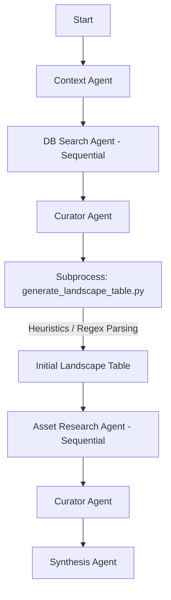
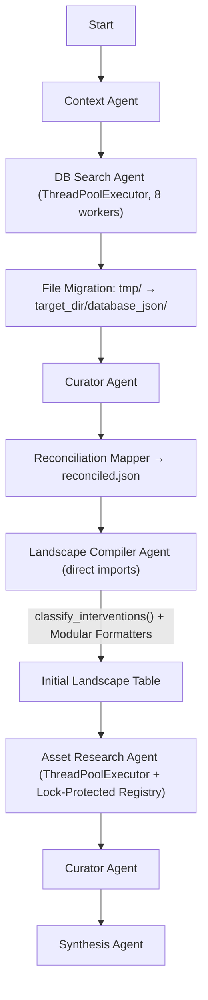

# Biotech Analyst CLI - Broad Scan Refactor (`docs/bdscan_refactor.md`)

This document outlines the design and implementation specifications for the four major refactoring milestones of the Biotech Analyst CLI (`ba`) broad scan (`bdscan`) pipeline.

---

## Pipeline Architecture: Current vs. Post-Refactor

### Comparative Overview

| Phase / Aspect                    | Current Pipeline                                                                                                                                                                                                                                | Post-Refactor Pipeline                                                                                                                                                                                                       |
| :-------------------------------- | :---------------------------------------------------------------------------------------------------------------------------------------------------------------------------------------------------------------------------------------------- | :--------------------------------------------------------------------------------------------------------------------------------------------------------------------------------------------------------------------------- |
| **Database Search**               | Linear sequential execution of 8 databases. All raw JSONs written to project root `tmp/`.                                                                                                                                                       | Concurrent execution of registry queries (using `ThreadPoolExecutor(max_workers=8)`). Raw JSONs written directly to `{target_dir}/database_json/`.                                                                           |
| **Data Aggregation**              | Only ClinicalTrials.gov + ANZCTR and China CDE scrapes are merged in `deterministic_merge()`. Conferences, Chinese registries, Lens.org, PubChem, and openFDA results are summarized to `.txt` files but never merged into a structured schema. | A dedicated **Reconciliation Mapper** merges all 8 database outputs into a unified, asset-centric `reconciled.json` immediately after searching. Each source has an explicit mapping function.                               |
| **Alias Extraction & Validation** | Regex-based parenthetical parsing via `parse_asset_and_aliases()` that incorrectly captures modalities (e.g., `chemotherapy`) and secondary targets (e.g., `HER2`).                                                                             | LLM-based extraction via `classify_interventions()` (relocated to `src/tools/classify_interventions.py`) that outputs structured JSON synonyms and filters out invalid names.                                                |
| **Landscape Compilation**         | Passive shell wrapper calling `generate_landscape_table.py` as a subprocess with legacy heuristic table building (1,281-line monolith).                                                                                                         | `landscape_compiler_agent.py` orchestrates compilation via direct Python imports of modular formatters (`src/utils/landscape/`) and the LLM classifier tool (`src/tools/`). No subprocess calls.                             |
| **Web Research**                  | Sequential asset processing (slower performance).                                                                                                                                                                                               | Concurrent asset web research using `ThreadPoolExecutor(max_workers=4)` with a `threading.Lock`-protected shared-state registry to abort duplicate searches gracefully. Capped at 4 workers to avoid DuckDuckGo rate limits. |

### Visual Workflows

````carousel

<!-- slide -->

````

### AI Agent Directory & Turn Configuration

All AI agents in the `bdscan` pipeline reside in `src/agents/bdscan_agents/`. Below is their detailed configuration:

| Agent Name                   | File Path                                                                                                                          | Interaction Model            | Configured Turns  | Primary Responsibility                                                                                                                                   |
| :--------------------------- | :--------------------------------------------------------------------------------------------------------------------------------- | :--------------------------- | :---------------- | :------------------------------------------------------------------------------------------------------------------------------------------------------- |
| **Context Agent**            | [context_agent.py](file:///f:/AIML%20projects/biotech-analyst-cli/src/agents/bdscan_agents/context_agent.py)                       | **Single-Turn**              | 1 turn            | Analyzes input terms and writes the brief `context.md` strategy document.                                                                                |
| **Database Search Agent**    | [db_search_agent.py](file:///f:/AIML%20projects/biotech-analyst-cli/src/agents/bdscan_agents/db_search_agent.py)                   | **Multi-Turn**               | 4 turns           | Queries the 8 source databases (concurrently post-refactor), reviews results, adapts search queries, and paginates.                                      |
| **Curator Agent**            | [curator_agent.py](file:///f:/AIML%20projects/biotech-analyst-cli/src/agents/bdscan_agents/curator_agent.py)                       | **Single-Turn**              | 1 turn            | Ingests execution logs after search/web-search stages and condenses lessons into `learning.md` (max 20 lines per section).                               |
| **Landscape Compiler Agent** | [landscape_compiler_agent.py](file:///f:/AIML%20projects/biotech-analyst-cli/src/agents/bdscan_agents/landscape_compiler_agent.py) | **Single-Turn (Structured)** | 1 turn per batch  | Orchestrates table compilation via direct Python imports. Calls `classify_interventions()` from `src/tools/` and formatters from `src/utils/landscape/`. |
| **Asset Research Agent**     | [asset_research_agent.py](file:///f:/AIML%20projects/biotech-analyst-cli/src/agents/bdscan_agents/asset_research_agent.py)         | **Multi-Turn**               | 4 turns per asset | Performs web searches, evaluates clinical significance, and fills in missing qualitative columns.                                                        |
| **Final Synthesis Agent**    | [synthesis_agent.py](file:///f:/AIML%20projects/biotech-analyst-cli/src/agents/bdscan_agents/synthesis_agent.py)                   | **Multi-Turn**               | 10 turns          | Synthesizes report findings and compiles the final strategic report.                                                                                     |

### Directory Layout & Storage Restructuring

To prevent polluting the project root's `tmp/` folder and organize files cleanly within pathway-specific scan directories, the pipeline's file storage structure will be updated:

| File Type / Purpose                                                          | Old Location                                                                          | New Location (Post-Refactor)                                                                                         |
| :--------------------------------------------------------------------------- | :------------------------------------------------------------------------------------ | :------------------------------------------------------------------------------------------------------------------- |
| **Raw Registry Database Results** (ClinicalTrials, China CDE, PubChem, etc.) | Project Root `tmp/` (e.g., `tmp/{query}_clinicaltrials.json`)                         | `target_dir/database_json/` (e.g., `{target_dir}/database_json/{query}_clinicaltrials.json`)                         |
| **Reconciled Master JSON** (`reconciled.json`)                               | _(does not exist)_                                                                    | `target_dir/database_json/reconciled.json`                                                                           |
| **Asset Configuration** (`asset_config.json`)                                | _(does not exist — config is built transiently inside `generate_landscape_table.py`)_ | `target_dir/database_json/asset_config.json` (persisted output of `discover_config()` + `merge_config_duplicates()`) |
| **Web Research Logs**                                                        | `{target_dir}/research/web_research_log_*.md`                                         | `{target_dir}/web_search/web_research_log_*.md`                                                                      |
| **Compiled Markdown Landscape Table**                                        | `{target_dir}/research/landscape_table.md`                                            | `{target_dir}/research/landscape_table.md` (unchanged — remains for report synthesis consolidation)                  |

_Note: `{target_dir}` represents the target pathway scan folder (e.g., `outputs/CLDN18.2_Scan/`). The orchestrator's directory initialization block in [bdscan_orchestrator.py](file:///f:/AIML%20projects/biotech-analyst-cli/src/core/bdscan_orchestrator.py) must be updated to create `database_json/` and `web_search/` alongside the existing `research/` and `final_output/` directories._

---

## Migration & Rollout Strategy

### Milestone Dependency Graph


**Execution order:** §3 → §1 → §2 → §4.

- **§3 (Monolith Decomposition)** is a pure refactor with no behavior change. It must land first because §1 and §2 both need to import from the new modular locations.
- **§1 (Reconciliation)** depends on the modular formatters and `classify_interventions()` from §3 being importable.
- **§2 (LLM Alias Resolution)** extends the classifier output from §3 and reads from the reconciled JSON produced by §1.
- **§4 (Concurrency)** is independent of the data-flow changes but should land last to avoid debugging concurrency bugs on top of structural changes.

### Backward-Compatibility Contract

Each milestone must maintain a working pipeline at all times:

1. **§3**: After decomposition, the `landscape_compiler_agent.py` must produce **byte-identical output** to the current subprocess-based version for the same inputs. Validate with a diff test on a known scan output.
2. **§1**: During the transition, `db_search_agent.py` writes raw JSONs to **both** `tmp/` and `{target_dir}/database_json/`. Once the landscape compiler and all downstream consumers are confirmed to read from `database_json/`, the `tmp/` writes are removed.
3. **§2**: The `parse_asset_and_aliases()` function remains available in `src/utils/landscape/table_formatters.py` as a fallback. It is only deleted after the LLM alias resolver passes all existing test cases.
4. **§4**: A `--sequential` CLI flag is added to `ba bdscan` to force the pre-concurrency execution path for debugging.

---

## 1. Database Result Reconciliation

### Objective

Provide a unified, asset-centric JSON structure that aggregates data across all 8 supported registries and databases (ClinicalTrials.gov, ChinaDrugTrials, PubChem, openFDA, Lens.org patent queries, conferences, CTIS/ANZCTR, and Chinese registries) before compiling tables and initiating web research.

### Design Details

#### Reconciled JSON Schema

Save the output under `{target_dir}/database_json/reconciled.json`. The top-level structure is a JSON object keyed by canonical asset names. Each entry contains:

```json
{
  "canonical_name": "Zolbetuximab",
  "aliases": ["Vyloy", "IMAB362", "佐妥昔单抗"],
  "sponsors": ["Astellas Pharma", "Ganymed"],
  "modality": "Monoclonal Antibody",
  "lead_indication": "Gastric / GEJ Adenocarcinoma",
  "trials": {
    "clinicaltrials": [
      {
        "id": "NCT03504397",
        "status": "COMPLETED",
        "phase": "PHASE3",
        "title": "SPOTLIGHT Study..."
      }
    ],
    "china_cde": [
      {
        "id": "CTR20182245",
        "status": "进行中",
        "company": "安斯泰来",
        "drug_name": "佐妥昔单抗"
      }
    ],
    "anzctr_ctis": [
      { "id": "ACTRN12617000XXXp", "status": "Recruiting", "title": "..." }
    ],
    "chinese_registries": [
      { "id": "ChiCTR2100042XXX", "status": "招募中", "title": "..." }
    ]
  },
  "patents": [
    {
      "id": "US10450378B2",
      "title": "Antibodies against Claudin 18.2...",
      "assignee": "Ganymed"
    }
  ],
  "conferences": [
    {
      "title": "Zolbetuximab combined with mFOLFOX6...",
      "event": "ASCO 2023",
      "abstract_id": "LBA4002"
    }
  ],
  "pubchem": {
    "cid": 138734994,
    "bioassays": 4
  },
  "openfda": {
    "adverse_events": 124,
    "labels": ["Vyloy FDA approval label text snippet..."]
  }
}
```

_Key change vs. original: `other_registries` is eliminated. ANZCTR/CTIS and Chinese WHO registries each get their own explicit key under `trials`. This prevents ambiguity about which sources populate `other_registries`._

#### Source-to-Schema Mapping Functions

Each of the 8 sources requires a dedicated mapper that extracts records from its raw JSON format and returns a normalized structure. These mappers live in a new file: **`src/utils/landscape/reconciliation.py`**.

The mappers perform only **structural extraction** (pulling fields from known JSON paths). They do **not** perform name matching, alias resolution, or drug code identification — that is the LLM's job in the matching step.

| Source                 | Raw JSON Location  | Mapper Function                                         | Extraction Logic                                                                  |
| :--------------------- | :----------------- | :------------------------------------------------------ | :-------------------------------------------------------------------------------- |
| ClinicalTrials.gov     | `*_ct_*.json`      | `map_clinicaltrials(raw_data) -> list[AssetRecord]`     | `protocolSection.armsInterventionsModule.interventions[].name` and `otherNames[]` |
| ANZCTR / CTIS          | `*_anzctr_*.json`  | `map_anzctr_ctis(raw_data) -> list[AssetRecord]`        | `results[].title`, cross-ref NCT IDs from `dbCrossReferenceList`                  |
| China CDE (Playwright) | `*_cdirect_*.json` | `map_china_cde(raw_data) -> list[AssetRecord]`          | `records[].drug_name`, `records[].acceptance_number`                              |
| Chinese WHO Registries | `*_chreg_*.json`   | `map_chinese_registries(raw_data) -> list[AssetRecord]` | `results[].title` — raw title text passed to LLM for name extraction              |
| Conferences            | `*_conf_*.json`    | `map_conferences(raw_data) -> list[ConferenceRecord]`   | `results[].title` — raw title text passed to LLM for name extraction              |
| Lens.org Patents       | `*_lens_*.json`    | `map_patents(raw_data) -> list[PatentRecord]`           | `results[].title`, `results[].assignee`                                           |
| PubChem                | `*_pubchem_*.json` | `map_pubchem(raw_data) -> PubChemRecord`                | CID, bioassay count, molecular formula                                            |
| openFDA                | `*_openfda_*.json` | `map_openfda(raw_data) -> OpenFDARecord`                | Adverse event count, label text snippets                                          |

_Note: Sources with structured drug name fields (ClinicalTrials.gov, China CDE, PubChem, openFDA) extract names directly from those fields. Sources where drug names are embedded in free-text titles (conferences, Chinese WHO registries) pass the raw title text to the LLM for extraction — no regex-based drug code parsing._

#### Matching Algorithm (LLM-Primary)

The reconciliation mapper uses the LLM as the **primary matching engine** for all name resolution. Per AGENTS.md: _"Prefer AI agents and LLM calls over heuristics, which are brittle and unreliable."_

**Step 1 — Trivial exact-dedup (preprocessing only):** Before calling the LLM, collapse names that are literally identical after lowercasing (e.g., `"Zolbetuximab"` and `"zolbetuximab"`). This is a pure optimization to reduce LLM token usage, not a matching heuristic.

**Step 2 — LLM-based classification and grouping:** All unique extracted names from all 8 sources (including Chinese names, brand names, codenames, and free-text title strings) are batched through `classify_interventions()` from `src/tools/classify_interventions.py`. The LLM:

- Classifies each name as `"asset"` or `"background"` (modalities, targets, placebos → background)
- Groups synonyms into clusters (e.g., `Zolbetuximab`, `Vyloy`, `IMAB362`, `佐妥昔单抗` → same cluster)
- Selects a canonical name per cluster
- Extracts modality and target annotations per the extended schema from §2

This single LLM call replaces what was previously three separate heuristic steps: `normalize_drug_name()` matching, regex drug code extraction, and `parse_asset_and_aliases()` parenthetical parsing.

**Step 3 — Record assignment:** Using the LLM's synonym clusters, each source record is assigned to its canonical asset entry in `reconciled.json`. Records whose names were classified as `"background"` are dropped but logged to `{target_dir}/database_json/reconciliation_log.json` for audit.

**Cross-language alias resolution**: Chinese ↔ English name linking (e.g., `佐妥昔单抗` ↔ `Zolbetuximab`) is handled entirely by the LLM during Step 2. The LLM has native multilingual capability and pharmaceutical naming knowledge to group these correctly. No heuristic lookup table is needed. Where structural hints exist (e.g., a China CDE record and a ClinicalTrials.gov record sharing a trial cross-reference ID), those hints are included in the LLM prompt as supporting context to improve accuracy.

#### Pipeline Integration

- Executed in [bdscan_orchestrator.py](file:///f:/AIML%20projects/biotech-analyst-cli/src/core/bdscan_orchestrator.py) immediately following the Database Search phase and the file migration step.
- The orchestrator calls `reconcile_all_sources(target_dir, folder_safe_name)` which:
  1. Globs `{target_dir}/database_json/*_*.json` for all raw source files
  2. Runs each source-specific mapper to extract raw names and records
  3. Batches all unique names through `classify_interventions()` for LLM-based classification and grouping
  4. Assigns records to canonical asset entries based on the LLM's synonym clusters
  5. Writes `reconciled.json` and `reconciliation_log.json`

---

## 2. LLM-Based Alias Resolution & Synonyms Extraction

### Objective

Eliminate brittle regex-based string extraction and dynamic cell-parsing heuristics that fail when extracting drug names, brands, or codenames from complex registry cells.

### Relationship to Existing Code

The current codebase already contains significant LLM-based classification infrastructure:

| Existing Function           | Location                                                                                                                      | Lines | Disposition                                                                                                                  |
| :-------------------------- | :---------------------------------------------------------------------------------------------------------------------------- | :---- | :--------------------------------------------------------------------------------------------------------------------------- |
| `classify_interventions()`  | [generate_landscape_table.py](file:///f:/AIML%20projects/biotech-analyst-cli/src/utils/generate_landscape_table.py) L345–L473 | ~130  | **Move** to `src/tools/classify_interventions.py`. Extend return schema.                                                     |
| `discover_config()`         | [generate_landscape_table.py](file:///f:/AIML%20projects/biotech-analyst-cli/src/utils/generate_landscape_table.py) L579–L734 | ~155  | **Move** to `src/utils/landscape/config_builder.py`.                                                                         |
| `parse_asset_and_aliases()` | [generate_landscape_table.py](file:///f:/AIML%20projects/biotech-analyst-cli/src/utils/generate_landscape_table.py) L132–L214 | ~82   | **Move** to `src/utils/landscape/table_formatters.py`. Keep as fallback until LLM resolver passes all tests, then deprecate. |

### Design Details

- **LLM Parsing Instead of Heuristics**: When parsing raw trial records or existing reports (e.g., `**Zolbetuximab**<br>*(Vyloy / Chemotherapy / HER2)*`), the agent passes the raw string to the LLM.
- **Extended `classify_interventions()` Schema**: The function in `src/tools/classify_interventions.py` is extended from returning `set[str]` to returning `list[dict]`:

  ```json
  {
    "canonical_name": "Zolbetuximab",
    "aliases": ["Vyloy", "IMAB362"],
    "modality": "Monoclonal Antibody",
    "targets": ["CLDN18.2"],
    "filtered_terms": ["Chemotherapy", "HER2", "immunotherapy"]
  }
  ```

  The existing batching logic (50 names per batch) is preserved, but batch size may need to decrease to ~30 to accommodate the richer output schema (more output tokens per item).

- **Single Source of Truth**: `src/tools/classify_interventions.py` is the **sole location** for all LLM-based intervention classification and alias resolution logic. It is imported by:
  - `src/utils/landscape/reconciliation.py` (§1 Phase 2 matching)
  - `src/agents/bdscan_agents/landscape_compiler_agent.py` (§3 table compilation)
  - `src/utils/landscape/config_builder.py` (synonym group building)

- **Downstream Consumer Update**: [asset_research_agent.py](file:///f:/AIML%20projects/biotech-analyst-cli/src/agents/bdscan_agents/asset_research_agent.py) currently imports `parse_asset_and_aliases` from the monolith (L9). After refactoring:
  - Import path changes to `from src.utils.landscape.table_formatters import parse_asset_and_aliases`
  - Once the LLM alias resolver is validated, `parse_asset_and_aliases()` calls are replaced with lookups against the persisted `asset_config.json` from reconciliation.

### Zero-Hallucination Synonym Validator

To ensure that the LLM does not hallucinate asset names or aliases during classification, the compilation pipeline runs a programmatic validator:

1. **Provenance Trace Verification**: Every asset name and alias in the LLM's output must trace back to at least one source record that was included in the classifier's input batch. The validator checks that each name appears **verbatim** in the raw text fields (titles, intervention names, drug name fields, or `otherNames` arrays) of the source records passed to the LLM. This is a strict containment check (case-insensitive), not a fuzzy match — if the LLM invents a name that wasn't in the input data, it is rejected.

   For cross-language names (e.g., `佐妥昔单抗` ↔ `Zolbetuximab`), both the Chinese and English names must independently trace to source records. The LLM may group them as synonyms, but each individual name must still have provenance in the raw data.

2. **LLM-Based Modality/Target Filter**: Rather than maintaining a static blocklist of rejected terms, a secondary LLM validation call reviews the classified `"asset"` list and flags any entries that are actually modalities (e.g., `"chemotherapy"`), target proteins (e.g., `"HER2"`, `"CLDN18.2"`), or generic treatment descriptions. This catches edge cases that the primary classifier may miss, without relying on a brittle hardcoded word list.

3. **Integration with `validate_report.py`**: The existing [validate_report.py](file:///f:/AIML%20projects/biotech-analyst-cli/src/utils/validate_report.py) will be extended to audit the persisted `asset_config.json` against the raw search JSONs under `{target_dir}/database_json/` before running subsequent stages.

---

## 3. Landscape Table Generator Refactoring

### Objective

Deconstruct the monolithic [generate_landscape_table.py](file:///f:/AIML%20projects/biotech-analyst-cli/src/utils/generate_landscape_table.py) (1,281 lines / 50 KB) into modular, focused files under `src/utils/landscape/` and `src/tools/`.

### Consolidating Formatting Modules

- `src/utils/formatting.py` already exists for terminal styling and console printing (Dr. Hops ASCII speech bubbles, warning logs).
- To prevent naming conflicts and modularize the landscape table processing logic, we keep CLI layout formatting separate from tabular data transformation.

### Complete Function-to-Module Mapping

Every public function in the current monolith is assigned a destination module:

| Function                         | Current Lines | Destination Module                        | Notes                                         |
| :------------------------------- | :------------ | :---------------------------------------- | :-------------------------------------------- |
| `clean_sponsor()`                | L37–L48       | `src/utils/landscape/table_formatters.py` | Pure string utility                           |
| `matches_drug()`                 | L51–L60       | `src/utils/landscape/table_formatters.py` | Alias matching helper                         |
| `parse_ct_phase()`               | L63–L95       | `src/utils/landscape/table_formatters.py` | Phase string parser                           |
| `parse_text_phase()`             | L98–L114      | `src/utils/landscape/table_formatters.py` | Chinese/English phase parser                  |
| `detect_formulation()`           | L117–L129     | `src/utils/landscape/table_formatters.py` | Formulation keyword extractor                 |
| `parse_asset_and_aliases()`      | L132–L214     | `src/utils/landscape/table_formatters.py` | Regex alias parser (deprecated after §2)      |
| `clean_cell_to_name()`           | L217–L219     | `src/utils/landscape/table_formatters.py` | Thin wrapper around `parse_asset_and_aliases` |
| `normalize_drug_name()`          | L500–L504     | `src/utils/landscape/table_formatters.py` | Canonical normalization                       |
| `_name_priority()`               | L476–L497     | `src/utils/landscape/table_formatters.py` | Synonym sorting key                           |
| `parse_existing_report()`        | L222–L342     | `src/utils/landscape/config_builder.py`   | Report metadata extraction                    |
| `classify_interventions()`       | L345–L473     | **`src/tools/classify_interventions.py`** | LLM classification tool                       |
| `discover_config()`              | L579–L734     | `src/utils/landscape/config_builder.py`   | Asset discovery & synonym grouping            |
| `merge_config_duplicates()`      | L507–L576     | `src/utils/landscape/config_builder.py`   | Duplicate merging                             |
| `_strip_md()`                    | L742–L752     | `src/utils/landscape/exporters.py`        | Markdown stripping helper                     |
| `md_table_to_text_table()`       | L755–L832     | `src/utils/landscape/exporters.py`        | Column-aligned text formatter                 |
| `md_table_to_csv()`              | L835–L871     | `src/utils/landscape/exporters.py`        | CSV exporter                                  |
| `main()` + trial processing loop | L874–L1281    | `src/utils/landscape/table_builder.py`    | Core table construction logic                 |
| CT/CDE status constants          | L14–L34       | `src/utils/landscape/table_formatters.py` | `CT_ACTIVE`, `CT_COMPLETED`, etc.             |

### Modularized Directory Structure

```
src/utils/landscape/
├── __init__.py
├── table_formatters.py    # Pure string/parsing utilities (~250 lines)
├── config_builder.py      # Asset discovery, synonym grouping, report parsing (~350 lines)
├── table_builder.py       # Core table construction loop from main() (~400 lines)
├── exporters.py           # md_table_to_text_table, md_table_to_csv, _strip_md (~160 lines)
└── reconciliation.py      # Source mappers and reconciliation logic (NEW, §1)

src/tools/
├── classify_interventions.py  # LLM-based intervention classifier (moved from monolith)
├── fetch_*.py                 # (existing fetchers, unchanged)
└── summarize_*.py             # (existing summarizers, unchanged)
```

### CLI Backward-Compatibility

The current `generate_landscape_table.py` has a CLI interface (`--clinicaltrials`, `--china-direct`, `--config`, `--output`, `--target-name`, `--target-synonyms`) that the `landscape_compiler_agent.py` calls as a subprocess. After refactoring:

- **`landscape_compiler_agent.py` switches to direct Python imports**, eliminating the subprocess call entirely. It directly calls `build_landscape_table()` from `src/utils/landscape/table_builder.py`.
- **A thin `__main__.py`** is added to `src/utils/landscape/` preserving the original CLI interface for any external scripts or ad-hoc usage:
  ```
  python -m src.utils.landscape --clinicaltrials ... --output ...
  ```
  This imports from the submodules and delegates to the same `build_landscape_table()` function.

### Updated Agent Responsibility

After refactoring, [landscape_compiler_agent.py](file:///f:/AIML%20projects/biotech-analyst-cli/src/agents/bdscan_agents/landscape_compiler_agent.py) becomes:

1. Reads `reconciled.json` from `{target_dir}/database_json/` (instead of raw JSONs from `tmp/`)
2. Calls `build_landscape_table()` from `src/utils/landscape/table_builder.py`
3. Applies `classify_interventions()` from `src/tools/classify_interventions.py` for any remaining unclassified names
4. Exports via `md_table_to_text_table()` and `md_table_to_csv()` from `src/utils/landscape/exporters.py`
5. Writes the final `landscape_table.md` and `.csv` to `{target_dir}/research/`

The agent file should be ~80–120 lines of orchestration code with zero business logic embedded.

---

## 4. Pipeline Concurrency

### Objective

Speed up the execution of the pipeline by executing the Database Search phase and the Web Research phase concurrently, while preventing race conditions.

### Concurrency Primitive

**`concurrent.futures.ThreadPoolExecutor`** (not `asyncio`). Rationale:

- The current tool functions in `db_search_agent.py` use `subprocess.run()` which is blocking. `ThreadPoolExecutor` wraps these naturally without rewriting to async.
- The LLM client already uses a thread-safe FIFO queue with `threading.Lock`, which is compatible with thread pools but would require adaptation for `asyncio`.
- The primary speedup comes from parallelizing the `subprocess.run()` fetch/summarize calls across 8 databases, not from the LLM agent turns.

### LLM Bottleneck Acknowledgment

> [!IMPORTANT]
> Each database search involves a 4-turn LLM reasoning loop, and the `LLMClient` processes requests through a FIFO queue. This means **LLM calls are serialized across all concurrent workers**. The expected speedup is ~2–4x (not 8x), coming primarily from parallelized network I/O and subprocess execution during the fetch/summarize steps. True 8x parallelism would require either multiple LLM API keys or removing the FIFO constraint (out of scope for this milestone).

### Design Details

#### Database Search Phase

Parallelize queries across the 8 distinct databases using `ThreadPoolExecutor(max_workers=8)`:

```python
from concurrent.futures import ThreadPoolExecutor, as_completed

with ThreadPoolExecutor(max_workers=8) as executor:
    futures = {
        executor.submit(run_source_search, source_name, tool_name, synonyms): source_name
        for source_name, tool_name, synonyms in sources
    }
    errors = []
    for future in as_completed(futures):
        source = futures[future]
        try:
            future.result()
        except Exception as e:
            errors.append((source, e))
            formatting.print_warning(f"Source '{source}' failed: {e}")

# Continue pipeline if at least 2 core sources (ClinicalTrials + CDE) succeeded
core_succeeded = {"ClinicalTrials.gov", "NMPA CDE Direct Search"} - {e[0] for e in errors}
if not core_succeeded:
    raise RuntimeError(f"Critical sources failed: {errors}")
```

**Error isolation**: Each worker runs inside its own `try/except`. A failure in one database (e.g., NMPA CDE Playwright timeout) does not crash the other 7. The pipeline continues if at least the two core trial sources succeed. All errors are collected and logged to the curator.

#### Web Research Phase

Execute asset web research concurrently using `ThreadPoolExecutor(max_workers=4)` (capped at 4 to avoid DuckDuckGo rate limits):

```python
with ThreadPoolExecutor(max_workers=4) as executor:
    futures = {
        executor.submit(research_single_asset, asset_name, cols): asset_name
        for asset_name, cols in unique_assets
    }
```

#### Thread-Safe Duplicate Asset Protection

The current `AssetResearchAgent.aliases_map` is an instance-level `dict` that is not thread-safe. With concurrent workers, it must be protected:

```python
import threading

class AssetResearchAgent:
    def __init__(self, ...):
        self._registry_lock = threading.Lock()
        self._claimed_assets: dict[str, str] = {}  # normalized_alias -> canonical_name
```

**Locking Protocol:**

1. **Before starting research on an asset**:

   ```python
   with self._registry_lock:
       # Check if any of this asset's aliases are already claimed
       for alias in all_aliases:
           key = normalize_drug_name(alias)
           if key in self._claimed_assets:
               parent = self._claimed_assets[key]
               # This is a duplicate — skip research, link to parent
               return link_duplicate(asset_name, parent)
       # Not a duplicate — register all aliases
       for alias in all_aliases:
           self._claimed_assets[normalize_drug_name(alias)] = canonical_name
   ```

2. **Mid-research alias discovery** (turn 2–4 finds a new synonym):

   ```python
   with self._registry_lock:
       key = normalize_drug_name(new_alias)
       if key in self._claimed_assets:
           other = self._claimed_assets[key]
           if other != canonical_name:
               # Collision: another worker is researching the same drug
               # Current worker continues (already invested turns)
               # but marks for post-research merge
               self._merge_queue.append((canonical_name, other))
       else:
           self._claimed_assets[key] = canonical_name
   ```

3. **Post-research merge**: After all workers complete, iterate `_merge_queue` and consolidate duplicate rows in the landscape table. The earlier-registered canonical name takes priority.

**Race condition prevention**: The critical window is two workers starting simultaneously for `"Zolbetuximab"` and `"IMAB362"`. Because both acquire the lock before starting (step 1), one will always register first and the other will detect the collision.

---

## Verification Plan

### Automated Tests

Each milestone adds tests to `tests/`:

| Milestone | Test File                        | Key Test Cases                                                                                                                                                                                                                     |
| :-------- | :------------------------------- | :--------------------------------------------------------------------------------------------------------------------------------------------------------------------------------------------------------------------------------- |
| §3        | `test_landscape_modules.py`      | Import all submodules; `clean_sponsor()`, `parse_ct_phase()` produce identical output to current monolith; `md_table_to_text_table()` round-trip; `build_landscape_table()` produces byte-identical output for known fixture input |
| §1        | `test_reconciliation.py`         | Each source mapper produces correct `AssetRecord` from fixture JSON; two-phase matching correctly merges normalized aliases; cross-language alias bridging links Chinese ↔ English names; orphans are logged                       |
| §2        | `test_classify_interventions.py` | Extended schema returns `list[dict]` with `modality`/`targets`/`filtered_terms`; batch size respected; hallucination validator rejects names not in source text; modality filter catches `"chemotherapy"`, `"HER2"`                |
| §4        | `test_concurrency.py`            | Thread pool completes with partial source failures; duplicate protection prevents same asset from being researched twice; `_registry_lock` prevents race conditions under `ThreadPoolExecutor(max_workers=4)`                      |

All tests must mock LLM calls and network requests per AGENTS.md testing standards.

### Manual Verification

- Run a full `ba bdscan` pipeline on a known target (e.g., `CLDN18.2`) and diff the `landscape_table.md` output against a baseline from the pre-refactor pipeline.
- Audit `reconciled.json` to confirm all 8 source types are represented.
- Audit `reconciliation_log.json` to confirm background terms were correctly filtered.
- Run `validate_report.py` against the final output to catch hallucinated IDs or data omissions.
