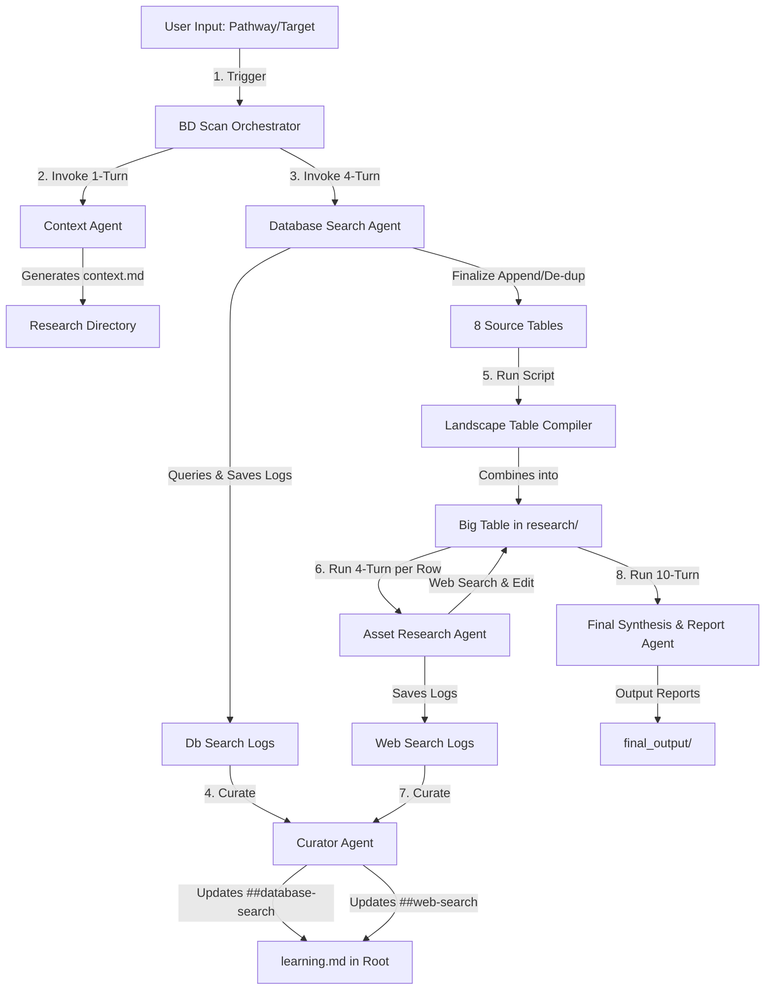

# Specification: Agentic BD Scan Pipeline (`docs/bdscan_spec.md`)

This specification details the agentic refactor for the `ba bdscan` pipeline. The goal is to replace the deterministic subprocess fetches with an orchestrator running multiple cooperative, structured agents to enhance accuracy, search depth, and analytical quality.

---

## 1. Pipeline Architecture & Orchestration

The pipeline is managed by a central **BD Scan Orchestrator** (`src/core/bdscan_orchestrator.py`) which sequences five distinct agents and one data-compiling utility script.
COMMENT: move bdscan and deepdive out of main and into their separate files in core/
COMMENT: for bdscan and deepdive, leave a bdscan_orchestrator and deepdive_orchestrator in core/ and create bdscan_agents and deepdive_agents folders to house each individual agent

---

## 2. Agent Configurations

### Agent 1: Context Agent (`src/agents/bdscan/context_agent.py`)

- **Mode:** One-turn generation agent.
- **Role:** Analyzes the user's initial target biological pathway/molecule class.
- **Objective:** Generates a concise scientific grounding document (`context.md`) saved directly under the research folder.
- **Guidelines:**
  - It must be shorter than the version in `asset-pipeline-research` to prevent LLM context-window bloating for downstream agents.
  - It provides high-level biological mechanism notes, disease settings, and standard modalities.
  - Acts as primary semantic context for subsequent database search and asset research agents.

---

### Agent 2: Database Search Agent (`src/agents/bdscan/db_search_agent.py`)

- **Mode:** Structured 4-turn loop agent, run **sequentially** for each of the eight database/registry fetching sources.
- **Turn Budget & State Loop:**
  - **Turn 1:** Reads synonyms and target metadata. Formulates search keywords (English for global, Mandarin translation for Chinese databases). Executes initial local registry queries.
  - **Turn 2:** Reviews raw search outputs, identifies gaps, handles spelling variations or formatting differences, and paginates.
  - **Turn 3:** Runs secondary/refined queries for assets found in other sources or synonyms that returned sparse data.
  - **Turn 4:** Merges, reformats, and compiles raw results.
- **Hallucination Prevention:** The final search logs of each source are saved to raw research files. The data mapping is compiled using a deterministic **append / de-duplicate utility script** (no LLM rewriting of trial data) to ensure 100% data integrity.
- **Curator Integration:** Execution logs are saved and passed to the `CuratorAgent` to update the global `learning.md` under the section `## database-search`.
  COMMENT: this seems too structured... for example, why wouldn't turn 2 just look at the results and generate new terms and perform the search? Turn 4 could do the same but just need to call finalize at the end.
  COMMENT: all the tools in util/ will need to be refactored into tools that agents can call

---

### Utility Script: Landscape Table Compiler (`src/agents/bdscan/compile_landscape.py`)

- **Objective:** Synthesizes the 8 source-specific tables created by the Database Search Agent into a single master landscape table.
- **Formatting Rules:**
  - One unique asset per row.
  - Collects and merges all sponsors, targets, indications, trials (CTR/NCT IDs), and formulations from the source files into unified table cells.
  - Saves this initial big landscape table under `research/`.

---

### Agent 4: Asset Research Agent (`src/agents/bdscan/asset_research_agent.py`)

- **Mode:** Structured 4-turn loop agent, executed **sequentially** for each asset (row) in the big table.
- **Tools Available:**
  - `web_search`: Query search engines for recent papers, news, and pipeline releases.
  - `edit_landscape_table`: Row-specific editing tool to write back details directly to the big table in `research/`.
- **Objective:** For each asset, research and verify critical diligence details via web search:
  - Alternative names and laboratory codes (e.g. "AMG-910" vs "AMG910"). COMMENT: this example is probably benign. I am more worried about different codes for same assets. Usually by partner sponsors.
  - Originator, licensing partner, and developer details.
  - Development status: Validate if the asset is still active, on hold, or discontinued (e.g. checking recent financial/pipeline updates).
  - Exclusivity, selectivity constants, safety profiles, and key clinical milestones.
- **Curator Integration:** Execution logs are saved and passed to the `CuratorAgent` to update the global `learning.md` under the section `## web-search`.
  COMMENT: the info from web search should be written in new columns. The existing columns should be immutable to prevent hallucination.
  COMMENT: this needs to be designed such that after each 4-turn agent, the alternative names are searched and the relevant entries are marked, so there's no duplicative search efforts for those rows.

---

### Agent 5: Final Synthesis & Report Agent (`src/agents/bdscan/synthesis_agent.py`)

- **Mode:** 10-turn strategic synthesis agent.
- **Tools Available:**
  - `web_search`: Cross-reference market size, regulatory policies, pricing, and standard of care.
- **Objective:** Compiles the final analysis outputs and strategic recommendations.
- **Outputs (written to `final_output/`):**
  1. **Summarized Output Table:** A clean, reconciled competitive matrix representing all active/promising candidates, clinical phases, and developer attributes.
  2. **Diligence Memo / Report:** A deep strategic markdown report detailing pathway rationale, differentiation vectors, and licensing catalysts.
- **Execution Constraint:** To prevent page-splitting issues during PDF compilation, the synthesized report markdown must **not** embed the big table inline. The report and the table will be generated as two separate markdown documents.
  COMMENT: check asset-pipeline-research/output/ for sample output

---

### Curator Agent (`src/agents/bdscan/curator_agent.py`)

- **Mode:** Stage-end curation agent.
- **Objective:** Aggregates logs from the database search and web search runs to update rules and search lessons.
- **Difference from Financial CLI:** Instead of local ticker-specific folders, this curator maintains a **single global file** at `f:\AIML projects\biotech-analyst-cli\self-improving\learning.md` in the project root.
- **Sections Maintained:** These should be 20 lines max.
  - `## database-search`: Tracks optimal search keyword strategies, translation maps, and database quirks.
  - `## web-search`: Tracks site locations, sponsor registries, pipeline tracking urls, and nomenclature rules.
